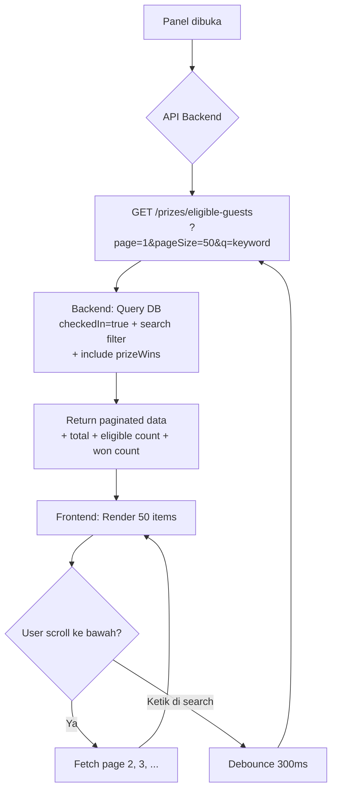
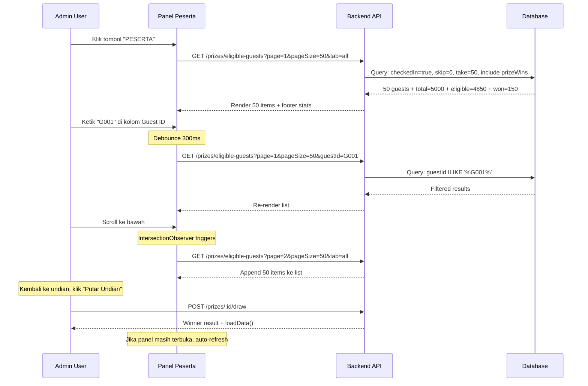

# Implementation Plan: Panel Daftar Tamu Eligible Lucky Draw (v2)

## Ringkasan

Menyempurnakan panel "Daftar Peserta Undian" di halaman Lucky Draw (`/luckydraw`) untuk mendukung **5000+ tamu** dengan:
1. **Server-side pagination** — mengganti pendekatan `pageSize=1000` menjadi backend-driven pagination
2. **Pencarian by Guest ID** — kolom pencarian tambahan untuk cari tamu berdasarkan ID
3. **Virtualized scrolling** — hanya me-render item yang terlihat di viewport
4. **Infinite scroll / load more** — autofetch halaman berikutnya saat user scroll ke bawah

---

## Masalah Saat Ini

| Masalah | Detail |
|---------|--------|
| **Hanya 1000 tamu yang dimuat** | `loadData()` baris 79: `apiFetch('/guests?checkedIn=true&pageSize=1000')` — truncate di 1000 |
| **Tidak ada field `guestId`** | Interface `Guest` (baris 16-23) tidak punya `guestId`, padahal backend mengirimnya |
| **Render semua DOM sekaligus** | 5000 item = ~5000 DOM node, menyebabkan lag saat scroll |
| **Pencarian hanya client-side** | Tidak efektif untuk 5000+ record yang belum semuanya dimuat |

---

## Arsitektur Solusi

### Pendekatan: Hybrid (Backend Pagination + Client Search)



> [!IMPORTANT]
> **Mengapa backend pagination?** Dengan 5000 tamu, memuat semua ke frontend (`pageSize=5000`) mengkonsumsi ~2-5MB RAM di browser dan menyebabkan initial load lambat. Backend pagination memuat 50 item per request (~50KB), jauh lebih efisien.

---

## Detail Implementasi

### 1. Backend: Endpoint Baru `GET /prizes/eligible-guests`

**File:** [prizes.controller.ts](file:///e:/Vibe/Registrasi%20Tamu/apps/backend/src/prizes/prizes.controller.ts)

```typescript
@UseGuards(JwtAuthGuard)
@Get('eligible-guests')
async getEligibleGuests(
    @Query('page') page?: string,
    @Query('pageSize') pageSize?: string,
    @Query('q') q?: string,
    @Query('guestId') guestId?: string,
    @Query('tab') tab?: string, // 'all' | 'eligible' | 'won'
) {
    return this.prizes.getEligibleGuests({
        page: parseInt(page || '1'),
        pageSize: parseInt(pageSize || '50'),
        q: q?.trim(),
        guestId: guestId?.trim(),
        tab: tab as 'all' | 'eligible' | 'won' || 'all',
    });
}
```

**File:** [prizes.service.ts](file:///e:/Vibe/Registrasi%20Tamu/apps/backend/src/prizes/prizes.service.ts)

```typescript
async getEligibleGuests(params: {
    page: number;
    pageSize: number;
    q?: string;
    guestId?: string;
    tab?: 'all' | 'eligible' | 'won';
}) {
    const active = await this.events.getActive();
    if (!active) return { data: [], total: 0, eligible: 0, won: 0, page: 1, pageSize: 50 };

    const { page, pageSize, q, guestId, tab } = params;

    // Base filter: tamu hadir di event aktif
    const baseWhere: any = {
        eventId: active.id,
        checkedIn: true,
    };

    // Search filters (OR condition)
    const searchConditions: any[] = [];
    if (q) {
        searchConditions.push(
            { name: { contains: q, mode: 'insensitive' } },
            { company: { contains: q, mode: 'insensitive' } },
            { division: { contains: q, mode: 'insensitive' } },
        );
        // Check jika q adalah angka → cari queueNumber
        if (!isNaN(Number(q))) {
            searchConditions.push({ queueNumber: parseInt(q) });
        }
    }
    if (guestId) {
        searchConditions.push(
            { guestId: { contains: guestId, mode: 'insensitive' } },
        );
    }
    if (searchConditions.length > 0) {
        baseWhere.OR = searchConditions;
    }

    // Tab filter: eligible = belum menang, won = sudah menang
    if (tab === 'eligible') {
        baseWhere.prizeWins = { none: {} };
    } else if (tab === 'won') {
        baseWhere.prizeWins = { some: {} };
    }

    // Parallel queries: data + total + stats
    const [data, total, eligibleCount, wonCount] = await this.prisma.$transaction([
        this.prisma.guest.findMany({
            where: baseWhere,
            orderBy: [{ queueNumber: 'asc' }],
            skip: (page - 1) * pageSize,
            take: pageSize,
            select: {
                id: true,
                guestId: true,
                name: true,
                queueNumber: true,
                company: true,
                division: true,
                photoUrl: true,
                prizeWins: {
                    select: {
                        prize: { select: { name: true, category: true } },
                        wonAt: true,
                    }
                }
            }
        }),
        this.prisma.guest.count({ where: baseWhere }),
        // Stats tanpa filter tab untuk footer (selalu tampilkan total eligible/won)
        this.prisma.guest.count({
            where: { eventId: active.id, checkedIn: true, prizeWins: { none: {} } }
        }),
        this.prisma.guest.count({
            where: { eventId: active.id, checkedIn: true, prizeWins: { some: {} } }
        }),
    ]);

    return {
        data: data.map(g => ({
            id: g.id,
            guestId: g.guestId,
            name: g.name,
            queueNumber: g.queueNumber,
            company: g.company,
            division: g.division,
            photoUrl: g.photoUrl,
            wonPrizes: g.prizeWins.map(pw => pw.prize.name),
        })),
        total,
        eligible: eligibleCount,
        won: wonCount,
        totalCheckedIn: eligibleCount + wonCount,
        page,
        pageSize,
        totalPages: Math.ceil(total / pageSize),
    };
}
```

> [!TIP]
> **Performa**: Query menggunakan `select` (bukan `include`) untuk mengurangi data yang ditransfer. Index `[eventId, checkedIn]` di schema Prisma sudah ada (baris 112 di `schema.prisma`) sehingga query akan cepat.

---

### 2. Frontend: Update Interface & State

**File:** [page.tsx](file:///e:/Vibe/Registrasi%20Tamu/apps/frontend/app/luckydraw/page.tsx)

#### 2a. Tambah field `guestId` ke interface Guest

```typescript
interface Guest {
    id: string;
    guestId?: string;      // ← TAMBAHAN: Guest ID untuk pencarian
    name: string;
    company?: string;
    division?: string;
    photoUrl?: string;
    queueNumber: number;
}

// Interface baru untuk panel eligible
interface EligibleGuest {
    id: string;
    guestId: string;
    name: string;
    queueNumber: number;
    company?: string;
    division?: string;
    photoUrl?: string;
    wonPrizes: string[];   // Nama hadiah yang sudah dimenangkan
}

interface EligibleGuestsResponse {
    data: EligibleGuest[];
    total: number;
    eligible: number;
    won: number;
    totalCheckedIn: number;
    page: number;
    pageSize: number;
    totalPages: number;
}
```

#### 2b. State baru untuk panel

```typescript
// Existing
const [showEligiblePanel, setShowEligiblePanel] = useState(false);
const [searchQuery, setSearchQuery] = useState('');
const [activeTab, setActiveTab] = useState<'all' | 'eligible' | 'won'>('all');

// NEW: Dedicated state untuk panel peserta (server-driven)
const [searchGuestId, setSearchGuestId] = useState('');       // Pencarian by Guest ID
const [eligibleData, setEligibleData] = useState<EligibleGuest[]>([]);
const [eligibleMeta, setEligibleMeta] = useState({ total: 0, eligible: 0, won: 0, totalCheckedIn: 0, page: 1, totalPages: 1 });
const [eligibleLoading, setEligibleLoading] = useState(false);
const [loadingMore, setLoadingMore] = useState(false);
const listEndRef = useRef<HTMLDivElement>(null);
```

#### 2c. Fetch function untuk panel

```typescript
const PAGE_SIZE = 50;

const fetchEligibleGuests = async (page = 1, append = false) => {
    if (page === 1) setEligibleLoading(true);
    else setLoadingMore(true);

    try {
        const params = new URLSearchParams();
        params.set('page', String(page));
        params.set('pageSize', String(PAGE_SIZE));
        params.set('tab', activeTab);
        if (searchQuery.trim()) params.set('q', searchQuery.trim());
        if (searchGuestId.trim()) params.set('guestId', searchGuestId.trim());

        const res = await apiFetch<EligibleGuestsResponse>(`/prizes/eligible-guests?${params}`);

        if (append) {
            setEligibleData(prev => [...prev, ...res.data]);
        } else {
            setEligibleData(res.data);
        }
        setEligibleMeta({
            total: res.total,
            eligible: res.eligible,
            won: res.won,
            totalCheckedIn: res.totalCheckedIn,
            page: res.page,
            totalPages: res.totalPages,
        });
    } catch (e) {
        console.error('Failed to load eligible guests:', e);
    } finally {
        setEligibleLoading(false);
        setLoadingMore(false);
    }
};
```

#### 2d. Debounced search & auto-refresh

```typescript
// Debounce pencarian — fetch ulang 300ms setelah user berhenti mengetik
const searchTimeoutRef = useRef<NodeJS.Timeout>();

useEffect(() => {
    if (!showEligiblePanel) return;

    clearTimeout(searchTimeoutRef.current);
    searchTimeoutRef.current = setTimeout(() => {
        fetchEligibleGuests(1, false); // Reset ke page 1
    }, 300);

    return () => clearTimeout(searchTimeoutRef.current);
}, [searchQuery, searchGuestId, activeTab, showEligiblePanel]);

// Auto-refresh saat panel dibuka
useEffect(() => {
    if (showEligiblePanel) {
        fetchEligibleGuests(1, false);
    } else {
        // Reset state saat panel ditutup
        setSearchQuery('');
        setSearchGuestId('');
        setActiveTab('all');
        setEligibleData([]);
    }
}, [showEligiblePanel]);
```

---

### 3. Frontend: UI Panel yang Disempurnakan

#### Wireframe Layout

```
┌──────────────────────────────────────────────────────────────┐
│  👥 Daftar Peserta Undian   (150 eligible)                  X│
│──────────────────────────────────────────────────────────────│
│  🔍 [___Cari nama, perusahaan, divisi___________]           │
│  🏷️ [___Cari Guest ID (contoh: G001)_____________]          │
│──────────────────────────────────────────────────────────────│
│  [Semua (5000)] [Eligible (4850)] [Menang (150)]             │
│──────────────────────────────────────────────────────────────│
│  Menampilkan 50 dari 5000 tamu                               │
│                                                              │
│  #001 │ G001 │ Budi Santoso     │ PT ABC    │ ✅ Eligible    │
│  #002 │ G002 │ Siti Rahayu      │ PT XYZ    │ 🏆 Grand Prize│
│  #003 │ G003 │ Ahmad Wijaya     │ PT DEF    │ ✅ Eligible    │
│  ...  │ ...  │ ...              │ ...       │ ...            │
│  #050 │ G050 │ Dewi Lestari     │ PT GHI    │ ✅ Eligible    │
│                                                              │
│              [⏳ Memuat lagi...] ← Infinite scroll           │
│                                                              │
│──────────────────────────────────────────────────────────────│
│  Total Hadir: 5000 │ Eligible: 4850 │ Sudah Menang: 150     │
└──────────────────────────────────────────────────────────────┘
```

#### JSX Search Area (2 Kolom Pencarian)

```tsx
{/* Search Area */}
<div className="p-4 border-b border-brand-border bg-brand-surface/5 space-y-3">
    {/* Pencarian Umum (nama, perusahaan, divisi) */}
    <div className="relative">
        <Search size={20} className="absolute left-4 top-1/2 -translate-y-1/2 text-brand-surface/40" />
        <input
            type="text"
            value={searchQuery}
            onChange={(e) => setSearchQuery(e.target.value)}
            placeholder="Cari nama, perusahaan, atau nomor antrian..."
            className="w-full bg-brand-secondary/60 border border-brand-border rounded-xl pl-12 pr-4 py-3 text-brand-surface placeholder:text-brand-surface/30 focus:outline-none focus:ring-2 focus:ring-brand-primary/50"
        />
    </div>
    {/* Pencarian by Guest ID */}
    <div className="relative">
        <Hash size={20} className="absolute left-4 top-1/2 -translate-y-1/2 text-brand-surface/40" />
        <input
            type="text"
            value={searchGuestId}
            onChange={(e) => setSearchGuestId(e.target.value)}
            placeholder="Cari Guest ID (contoh: G001, INV-0042)..."
            className="w-full bg-brand-secondary/60 border border-brand-border rounded-xl pl-12 pr-4 py-3 text-brand-surface placeholder:text-brand-surface/30 focus:outline-none focus:ring-2 focus:ring-brand-primary/50 font-mono"
        />
    </div>
</div>
```

> [!NOTE]
> Icon `Hash` di-import dari `lucide-react` untuk kolom Guest ID. Kolom ini menggunakan `font-mono` karena Guest ID biasanya berformat kode (G001, INV-0042, dll).

#### JSX Guest Item (dengan Guest ID)

```tsx
{eligibleData.map(guest => (
    <div key={guest.id} className={`flex items-center gap-4 p-3 rounded-xl border transition-colors ${
        guest.wonPrizes.length > 0
            ? 'bg-brand-primary/5 border-brand-primary/20'
            : 'bg-brand-surface/5 border-brand-border hover:bg-brand-surface/10'
    }`}>
        {/* Queue Number */}
        <div className="w-10 h-10 rounded-full bg-brand-primary/15 flex items-center justify-center font-bold text-sm text-brand-primary flex-shrink-0">
            {guest.queueNumber}
        </div>

        {/* Info */}
        <div className="flex-1 min-w-0">
            <div className="flex items-center gap-2">
                <span className="font-bold text-brand-surface truncate">{guest.name}</span>
                <span className="text-xs font-mono text-brand-surface/30 bg-brand-surface/5 px-2 py-0.5 rounded flex-shrink-0">
                    {guest.guestId}
                </span>
            </div>
            <div className="text-xs text-brand-surface/50 truncate">
                {guest.company || '-'}
                {guest.division && <span className="ml-1">({guest.division})</span>}
            </div>
        </div>

        {/* Status Badge */}
        {guest.wonPrizes.length > 0 ? (
            <div className="flex items-center gap-1 px-3 py-1 rounded-full bg-brand-primary/20 text-brand-primary text-xs font-mono whitespace-nowrap">
                <Award size={14} />
                <span className="truncate max-w-[150px]">{guest.wonPrizes.join(', ')}</span>
            </div>
        ) : (
            <div className="px-3 py-1 rounded-full bg-green-500/15 text-green-400 text-xs font-mono">
                ✓ Eligible
            </div>
        )}
    </div>
))}
```

#### JSX Infinite Scroll Trigger

```tsx
{/* Pagination indicator + Load More trigger */}
{eligibleMeta.page < eligibleMeta.totalPages && (
    <div ref={listEndRef} className="flex justify-center py-4">
        {loadingMore ? (
            <div className="flex items-center gap-2 text-brand-surface/40 text-sm">
                <div className="w-4 h-4 border-2 border-brand-primary/30 border-t-brand-primary rounded-full animate-spin" />
                Memuat lagi...
            </div>
        ) : (
            <button
                onClick={() => fetchEligibleGuests(eligibleMeta.page + 1, true)}
                className="px-6 py-2 bg-brand-surface/10 hover:bg-brand-surface/20 rounded-full text-sm text-brand-surface/60 transition-colors"
            >
                Muat {Math.min(PAGE_SIZE, eligibleMeta.total - eligibleData.length)} tamu lagi
                ({eligibleData.length}/{eligibleMeta.total})
            </button>
        )}
    </div>
)}

{/* Info jumlah yang ditampilkan */}
{eligibleData.length > 0 && (
    <div className="text-center text-xs text-brand-surface/30 pt-2">
        Menampilkan {eligibleData.length} dari {eligibleMeta.total} tamu
    </div>
)}
```

#### Intersection Observer (Auto-Load More)

```typescript
// Auto load more saat scroll ke bawah (Intersection Observer)
useEffect(() => {
    if (!showEligiblePanel || !listEndRef.current) return;

    const observer = new IntersectionObserver(
        (entries) => {
            if (entries[0].isIntersecting && !loadingMore && eligibleMeta.page < eligibleMeta.totalPages) {
                fetchEligibleGuests(eligibleMeta.page + 1, true);
            }
        },
        { threshold: 0.1 }
    );

    observer.observe(listEndRef.current);
    return () => observer.disconnect();
}, [showEligiblePanel, loadingMore, eligibleMeta.page, eligibleMeta.totalPages]);
```

---

### 4. Tambahan Import

```typescript
import { Trophy, Sparkles, PartyPopper, History, X, Users, Search, Award, Hash } from 'lucide-react';
//                                                                           ^^^^ tambahan
```

---

### 5. Data Loading `loadData()` — Perbaikan pageSize

> [!WARNING]
> **Masalah kritis**: `loadData()` saat ini hanya memuat 1000 tamu (`pageSize=1000`). Untuk 5000 tamu, animasi undian (baris 146-162) hanya menampilkan 1000 nama yang berputar, bukan 5000.

**Solusi**: Untuk `candidates` yang dipakai oleh animasi undian, naikkan `pageSize` menjadi `10000` atau lakukan multi-page fetch:

```typescript
// Option A: Naikkan limit (paling sederhana, cukup untuk ~10K tamu)
apiFetch<{ data: Guest[] }>('/guests?checkedIn=true&pageSize=10000')

// Option B: Multi-page fetch (untuk skala enterprise)
const fetchAllCandidates = async (): Promise<Guest[]> => {
    let allGuests: Guest[] = [];
    let page = 1;
    const size = 1000;
    while (true) {
        const res = await apiFetch<{ data: Guest[], total: number }>(
            `/guests?checkedIn=true&pageSize=${size}&page=${page}`
        );
        allGuests = [...allGuests, ...res.data];
        if (allGuests.length >= res.total || res.data.length < size) break;
        page++;
    }
    return allGuests;
};
```

> [!IMPORTANT]
> Panel "PESERTA" menggunakan endpoint baru yang **terpisah** dari `loadData()`. Jadi data panel tidak lagi bergantung pada `candidates` state yang terbatas 1000 item.

---

## Alur Interaksi



---

## Checklist Implementasi

### Backend
- [ ] Tambah method `getEligibleGuests()` di `prizes.service.ts`
- [ ] Tambah endpoint `GET /prizes/eligible-guests` di `prizes.controller.ts`
- [ ] Support query params: `page`, `pageSize`, `q`, `guestId`, `tab`

### Frontend
- [ ] Tambah `guestId` ke interface `Guest`
- [ ] Tambah interface `EligibleGuest` dan `EligibleGuestsResponse`
- [ ] Import icon `Hash` dari `lucide-react`
- [ ] Tambah state: `searchGuestId`, `eligibleData`, `eligibleMeta`, `eligibleLoading`, `loadingMore`
- [ ] Implementasi `fetchEligibleGuests()` dengan pagination
- [ ] Implementasi debounced search (300ms delay)
- [ ] Tambah kolom pencarian **Guest ID** dengan icon `#`
- [ ] Tampilkan `guestId` di setiap item list (badge kecil di samping nama)
- [ ] Implementasi Infinite Scroll dengan IntersectionObserver
- [ ] Tambah "Load More" button sebagai fallback
- [ ] Tampilkan "Menampilkan X dari Y tamu" di bawah list
- [ ] Auto-refresh panel setelah draw winner (`loadData()` / `prize_draw` SSE event)
- [ ] Perbaiki `pageSize` di `loadData()` dari 1000 → 10000 untuk animasi undian
- [ ] Testing: 5000 tamu, pencarian by ID, pencarian by nama, tab filter, infinite scroll

---

## Estimasi Dampak

| Aspek | Sebelum (v1) | Sesudah (v2) |
|-------|-------------|-------------|
| **Max tamu didukung** | ~1000 (hardcoded pageSize) | Unlimited (server-side pagination) |
| **Initial load panel** | ~1-5MB (semua data sekaligus) | ~50KB (50 items per page) |
| **DOM nodes di list** | 5000 nodes | 50-200 nodes (incremental) |
| **Pencarian by Guest ID** | ❌ Tidak ada | ✅ Dedicated field |
| **Backend changes** | Tidak ada | 1 endpoint baru (non-breaking) |
| **Frontend file changes** | 1 file | 1 file (`page.tsx`) |
| **Breaking changes** | - | Tidak ada |
