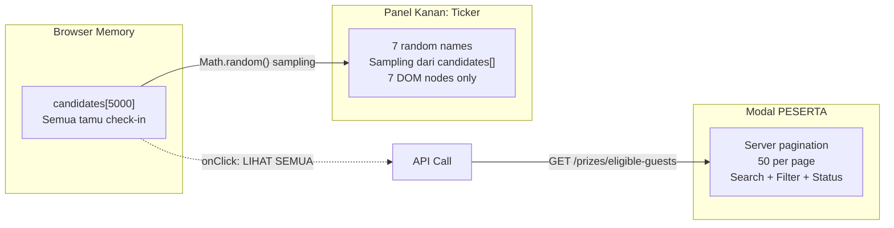

# Implementation Plan: Lucky Draw Split-Screen Rework (v2)

## Tujuan

Merombak halaman Lucky Draw dari layout **single-column centered** menjadi **split-screen dua panel**:

- **Panel Kiri (60%)**: Mesin undian utama — prize selector, slot display, tombol putar
- **Panel Kanan (40%)**: Live rolling ticker nama eligible + akses tombol "PESERTA" untuk browsing seluruh 5000 tamu

Tambahan: **Drama level berbeda berdasarkan kategori hadiah** — hadiah UTAMA (Grand Prize) mendapat animasi lebih dramatis, panjang, dan menegangkan dibanding hadiah HIBURAN.

---

## Konsep Visual

```
┌──────────────────────────────────────────┬───────────────────────────────────┐
│            🏠 EVENT LOGO                │  ┌── LIVE ELIGIBLE ─────────────┐ │
│                                          │  │  ● LIVE        4,850 NAMES  │ │
│         ✨ L U C K Y  D R A W ✨        │  ├────────────────────────────────┤ │
│                                          │  │                              │ │
│      [▼ Grand Prize - Mobil (0/1) ▼]    │  │  ▲ (blur gradient top) ▲     │ │
│                                          │  │                              │ │
│   ┌──────────────────────────────────┐   │  │  ┌──────────────────────┐    │ │
│   │                                  │   │  │  │ #087 RIZA RODINI     │    │ │
│   │          ┌──────────┐           │   │  │  └──────────────────────┘    │ │
│   │          │  FOTO /  │           │   │  │  ┌──────────────────────┐    │ │
│   │          │  NOMOR   │           │   │  │  │ #142 BUDI SANTOSO    │    │ │
│   │          └──────────┘           │   │  │  └──────────────────────┘    │ │
│   │                                  │   │  │  ┌══════════════════════┐    │ │
│   │      NAMA TAMU BERPUTAR         │   │  │  ║ #233 DEWI LESTARI   ║←── │ │
│   │      PT PERUSAHAAN              │   │  │  ║ PT Harmoni Nusantara ║ctr │ │
│   │                                  │   │  │  └══════════════════════┘    │ │
│   └──────────────────────────────────┘   │  │  ┌──────────────────────┐    │ │
│                                          │  │  │ #401 AHMAD WIJAYA    │    │ │
│     ╔════════════════════════════╗        │  │  └──────────────────────┘    │ │
│     ║   🎲 PUTAR UNDIAN          ║        │  │                              │ │
│     ║   ◆ GRAND PRIZE MODE ◆     ║        │  │  ▼ (blur gradient bottom) ▼ │ │
│     ╚════════════════════════════╝        │  │                              │ │
│                                          │  ├────────────────────────────────┤ │
│   ── Pemenang: ─────────────            │  │  Hadir: 5,000 │ Menang: 150  │ │
│   [🏆 #155 Priscila] [🏆 #157 Gisela]  │  │  ████████████████░░░ 97%     │ │
│                                          │  ├────────────────────────────────┤ │
│   [👥 PESERTA] [📜 RIWAYAT]            │  │  [👁 LIHAT SEMUA 5,000 TAMU] │ │
│                                          │  └────────────────────────────────┘ │
└──────────────────────────────────────────┴───────────────────────────────────┘
```

---

## Masalah: 5000 Tamu → Bagaimana Ditampilkan?

### Strategi: Ticker ≠ Browser

| Komponen | Fungsi | Data Source |
|----------|--------|-------------|
| **Ticker (panel kanan)** | Visual excitement — 7 nama random bergulir | **Client-side sampling** dari `candidates[]` di memory. Hanya render 7 DOM node, bukan 5000. |
| **Tombol "LIHAT SEMUA" (di bawah ticker)** | Membuka modal PESERTA yang sudah ada | **Server-side pagination** via `GET /prizes/eligible-guests?page=1&pageSize=50` |

> [!IMPORTANT]
> **Ticker TIDAK merender 5000 tamu.** Ticker hanya menampilkan 7 nama acak pada satu waktu — setiap tick, 1 baris diganti dengan nama random lain dari pool 5000. Ini memberi ilusi bahwa "semua nama berputar" tanpa membebani DOM.
>
> Untuk **melihat data lengkap** semua 5000 tamu (dengan search, filter, status hadiah), user menekan tombol "LIHAT SEMUA 5,000 TAMU" yang membuka modal PESERTA existing (server-driven pagination, 50 per page).

### Alur Data



### Tombol Akses di Panel Kanan (bawah ticker)

```tsx
{/* Di bawah ticker footer */}
<button
    onClick={() => setShowEligiblePanel(true)}
    className="w-full py-3 bg-brand-primary/10 hover:bg-brand-primary/20 border-t border-brand-primary/10 text-brand-primary text-sm font-mono tracking-widest uppercase transition-all flex items-center justify-center gap-2"
>
    <Users size={16} />
    LIHAT SEMUA {candidates.length.toLocaleString()} TAMU
</button>
```

---

## Drama Level: Kategori Hadiah

### Konsep: Semakin Besar Hadiah, Semakin Dramatis

| Aspek | HIBURAN (Door Prize) | UTAMA (Grand Prize) |
|-------|---------------------|---------------------|
| **Spin Duration** | 3 detik | 8 detik |
| **Ticker Speed (during spin)** | 120ms → stop | 60ms → perlambatan 5-tahap → stop |
| **Slowdown Stages** | 2 tahap: cepat → stop | 5 tahap: sangat cepat → cepat → sedang → lambat → sangat lambat → stop |
| **Sound Effect (future)** | Tick sederhana | Drum roll → heartbeat → cymbal crash |
| **Visual Effects** | Gold confetti | Gold confetti + layar berkedip + border pulse + screen shake |
| **Tombol Putar** | Normal gold | Pulsating red/gold + label "◆ GRAND PRIZE ◆" |
| **Ticker Background** | Subtle amber tint | Deep red pulse + moving scanlines |
| **Winner Reveal** | Nama muncul + confetti | Layar gelap sesaat → spotlight → nama muncul besar → confetti explosion |
| **Panel Kiri Slot** | Normal animation | Slot border berkedip merah + background particle effect |

### Implementasi: Drama Config

```typescript
// Drama level configuration per category
interface DramaConfig {
    spinDuration: number;        // Total spin time in ms
    tickerSpeedStart: number;    // Ticker ms during spin start
    tickerSpeedMin: number;      // Fastest ticker speed during peak spin
    slowdownStages: number[];    // Array of [speed, duration] for each slowdown stage
    confettiCount: number;       // Number of confetti particles
    enableScreenFlash: boolean;  // Flash screen white before reveal
    enableDarkReveal: boolean;   // Darken screen, spotlight winner
    enableScreenShake: boolean;  // Shake the draw container
    enableScanlines: boolean;    // Moving scanline effect on ticker
    buttonLabel: string;         // Custom button text
    buttonExtraClass: string;    // Extra CSS for button
}

const DRAMA_CONFIGS: Record<string, DramaConfig> = {
    HIBURAN: {
        spinDuration: 3000,
        tickerSpeedStart: 120,
        tickerSpeedMin: 80,
        slowdownStages: [300, 800],  // 2 stages
        confettiCount: 100,
        enableScreenFlash: false,
        enableDarkReveal: false,
        enableScreenShake: false,
        enableScanlines: false,
        buttonLabel: 'PUTAR UNDIAN',
        buttonExtraClass: '',
    },
    UTAMA: {
        spinDuration: 8000,
        tickerSpeedStart: 60,
        tickerSpeedMin: 40,
        slowdownStages: [100, 200, 400, 800, 2000],  // 5 stages dramatis
        confettiCount: 300,
        enableScreenFlash: true,
        enableDarkReveal: true,
        enableScreenShake: true,
        enableScanlines: true,
        buttonLabel: '◆ GRAND PRIZE ◆',
        buttonExtraClass: 'animate-grand-pulse ring-2 ring-red-500/50',
    },
};

// Usage
const drama = DRAMA_CONFIGS[selectedPrize?.category || 'HIBURAN'];
```

### Detail: Slowdown Sequence untuk UTAMA (Grand Prize)

```typescript
const executeGrandPrizeSlowdown = async (winner: Guest) => {
    const drama = DRAMA_CONFIGS.UTAMA;

    // ── Stage 1: Tetap sangat cepat (100ms) — 1.5s ──
    setTickerSpeed(100);
    await sleep(1500);

    // ── Stage 2: Mulai melambat (200ms) — 1.5s ──
    setTickerSpeed(200);
    // Ticker background berubah: amber → deep red pulse
    setTickerMood('tension');
    await sleep(1500);

    // ── Stage 3: Sedang (400ms) — 1s ──
    setTickerSpeed(400);
    await sleep(1000);

    // ── Stage 4: Lambat — penonton mulai deg-degan (800ms) — 1.5s ──
    setTickerSpeed(800);
    // Screen shake subtle
    setScreenShake(true);
    await sleep(1500);

    // ── Stage 5: Sangat lambat — hampir berhenti (2000ms) — 2s ──
    setTickerSpeed(2000);
    setScreenShake(false);
    await sleep(2000);

    // ── REVEAL ──
    clearInterval(tickerInterval);

    // Flash screen white for 200ms
    setScreenFlash(true);
    await sleep(200);
    setScreenFlash(false);

    // Darken everything except winner
    setDarkReveal(true);
    await sleep(500);

    // Inject winner di baris tengah ticker
    injectWinnerToCenter(winner);

    // Winner spotlight + massive confetti
    setHighlightedId(winner.id);
    confetti({
        particleCount: 300,
        spread: 120,
        startVelocity: 45,
        origin: { y: 0.5, x: 0.7 },  // Dari arah ticker
        colors: ['#FFD700', '#FFA500', '#FF69B4', '#FF0000', '#FFFFFF']
    });

    // Second burst
    setTimeout(() => {
        confetti({
            particleCount: 200,
            spread: 160,
            origin: { y: 0.3, x: 0.3 },
            colors: ['#FFD700', '#FFA500']
        });
    }, 500);

    // Restore normal after 3s
    await sleep(3000);
    setDarkReveal(false);
    setTickerMood('normal');
};
```

### CSS: Grand Prize Visual Effects

```css
/* ── Grand Prize Button Pulse ── */
@keyframes grand-pulse {
    0%, 100% {
        box-shadow: 0 0 30px rgba(255, 0, 0, 0.3), 0 0 60px rgba(212, 168, 83, 0.2);
    }
    50% {
        box-shadow: 0 0 50px rgba(255, 0, 0, 0.6), 0 0 100px rgba(212, 168, 83, 0.4);
    }
}

/* ── Screen Flash ── */
@keyframes screen-flash {
    0% { opacity: 0; }
    50% { opacity: 0.8; }
    100% { opacity: 0; }
}

/* ── Screen Shake ── */
@keyframes screen-shake {
    0%, 100% { transform: translate(0); }
    10% { transform: translate(-2px, 1px); }
    20% { transform: translate(2px, -1px); }
    30% { transform: translate(-1px, 2px); }
    40% { transform: translate(1px, -2px); }
    50% { transform: translate(-2px, 0); }
    60% { transform: translate(2px, 1px); }
    70% { transform: translate(-1px, -1px); }
    80% { transform: translate(1px, 2px); }
    90% { transform: translate(0, -2px); }
}

/* ── Scanline Effect (Grand Prize ticker) ── */
@keyframes scanline {
    0% { transform: translateY(-100%); }
    100% { transform: translateY(100vh); }
}

.scanline-overlay::after {
    content: '';
    position: absolute;
    inset: 0;
    background: linear-gradient(
        transparent 0%,
        rgba(255, 0, 0, 0.03) 50%,
        transparent 100%
    );
    height: 30%;
    animation: scanline 2s linear infinite;
    pointer-events: none;
}

/* ── Dark Reveal Overlay ── */
.dark-reveal {
    position: fixed;
    inset: 0;
    background: radial-gradient(
        circle at 70% 50%,
        transparent 200px,
        rgba(0, 0, 0, 0.85) 400px
    );
    z-index: 45;
    transition: opacity 0.5s ease;
}

/* ── Ticker Mood: Tension (red pulse) ── */
@keyframes tension-pulse {
    0%, 100% { background-color: rgba(255, 0, 0, 0); }
    50% { background-color: rgba(255, 0, 0, 0.05); }
}

.ticker-mood-tension {
    animation: tension-pulse 1s ease-in-out infinite;
}

.animate-grand-pulse {
    animation: grand-pulse 2s ease-in-out infinite;
}

.animate-screen-shake {
    animation: screen-shake 0.3s ease-in-out infinite;
}
```

### JSX: Grand Prize Visual Overlays

```tsx
{/* Screen Flash Overlay */}
{screenFlash && (
    <div className="fixed inset-0 z-[60] bg-white pointer-events-none animate-[screen-flash_0.3s_ease-out]" />
)}

{/* Dark Reveal Overlay (spotlight on ticker winner) */}
{darkReveal && (
    <div className="dark-reveal pointer-events-none" />
)}

{/* Screen Shake wrapper — hanya bungkus panel kiri */}
<div className={`flex-[3] flex flex-col items-center justify-center p-8 ${screenShake ? 'animate-screen-shake' : ''}`}>
```

---

## Updated Draw Button: Category-Aware

```tsx
<button
    onClick={handleDraw}
    disabled={spinning || isSoldOut || !selectedPrizeId}
    className={`
        relative px-16 py-6 rounded-full font-bold text-2xl font-mono tracking-[0.2em] uppercase
        transition-all duration-300 transform hover:scale-105 active:scale-95
        ${spinning
            ? 'bg-brand-border/50 text-brand-textMuted cursor-not-allowed border border-brand-border'
            : isSoldOut
                ? 'bg-brand-danger/20 text-brand-danger cursor-not-allowed border border-brand-danger/30'
                : `bg-gradient-to-r from-brand-primary to-brand-accent text-brand-secondary
                   shadow-[0_0_50px_rgba(212,168,83,0.4)] hover:shadow-[0_0_80px_rgba(212,168,83,0.6)]
                   border border-brand-primarySoft/50
                   ${drama.buttonExtraClass}`
        }
    `}
>
    {spinning ? (
        <span className="flex items-center gap-2">
            <span className="animate-spin">🎲</span>
            {drama === DRAMA_CONFIGS.UTAMA ? 'MENGUNDI GRAND PRIZE...' : 'Mengundi...'}
        </span>
    ) : isSoldOut ? (
        'Habis Terbagi'
    ) : (
        drama.buttonLabel
    )}
</button>
```

---

## Updated handleDraw: Category-Aware

```typescript
const handleDraw = async () => {
    if (!selectedPrizeId || spinning) return;

    const drama = DRAMA_CONFIGS[selectedPrize?.category || 'HIBURAN'];

    setSpinning(true);
    spinningRef.current = true;
    setWinner(null);

    // Start visual animation (panel kiri)
    const interval = setInterval(() => {
        if (candidates.length > 0) {
            const randomIdx = Math.floor(Math.random() * candidates.length);
            setDisplayCandidate(candidates[randomIdx]);
        }
    }, 50);

    // Notify ticker to speed up
    setTickerSpeed(drama.tickerSpeedMin);
    if (drama.enableScanlines) setTickerMood('tension');

    try {
        const result = await apiFetch<Guest>(`/prizes/${selectedPrizeId}/draw`, { method: 'POST' });

        // Wait for drama-appropriate duration
        setTimeout(async () => {
            clearInterval(interval);
            setDisplayCandidate(result);
            setWinner(result);

            if (drama === DRAMA_CONFIGS.UTAMA) {
                // === GRAND PRIZE: Full dramatic sequence ===
                await executeGrandPrizeSlowdown(result);
            } else {
                // === HIBURAN: Simple reveal ===
                setTickerSpeed(300);
                await sleep(500);
                setTickerSpeed(800);
                clearTickerInterval();
                injectWinnerToCenter(result);
                setHighlightedId(result.id);

                confetti({
                    particleCount: drama.confettiCount,
                    spread: 70,
                    origin: { y: 0.6 },
                    colors: ['#FFD700', '#FFA500', '#FF69B4', '#00FF00', '#00BFFF']
                });
            }

            setSpinning(false);
            spinningRef.current = false;
            loadData();
        }, drama.spinDuration);

    } catch (e: any) {
        clearInterval(interval);
        setSpinning(false);
        spinningRef.current = false;
        setTickerSpeed(800);
        setTickerMood('normal');
        alert(e.message || 'Gagal mengundi pemenang');
    }
};
```

---

## Timeline Perbandingan Visual

### HIBURAN (Door Prize) — 3 Detik

```
0s         1s         2s         3s
├──────────┼──────────┼──────────┤
│←── Spin cepat (80ms) ──→│Stop│
│  Ticker: 120ms           │800ms
│                          │ ✓ Confetti (100)
│                          │ ✓ Winner highlight
```

### UTAMA (Grand Prize) — 8 Detik

```
0s     1s     2s     3s     4s     5s     6s     7s     8s
├──────┼──────┼──────┼──────┼──────┼──────┼──────┼──────┤
│ Spin sangat cepat (40ms) │                             │
│ Ticker: 60ms             │                             │
│                    │100ms │200ms │400ms │800ms │2000ms │
│                    │      │      │ SHAKE│      │       │
│                    │      │ mood:│      │      │ STOP  │
│                    │      │ RED  │      │      │       │
│                                                 │FLASH │
│                                                 │DARK  │
│                                                 │ 💥💥💥│
│                                                 │ CONFETTI 300
│                                                 │ ✓ Spotlight reveal
```

---

## Alur State

```mermaid
stateDiagram-v2
    [*] --> Idle

    state "IDLE" as Idle {
        note right of Idle
            Ticker: 800ms (lambat)
            Mood: normal
            Panel kiri: "Siap Mengundi"
        end note
    }

    Idle --> SpinHiburan: Klik Putar (HIBURAN)
    Idle --> SpinUtama: Klik Putar (UTAMA)

    state "SPINNING: HIBURAN" as SpinHiburan {
        note right of SpinHiburan
            Duration: 3s
            Ticker: 120ms
            Confetti: 100
        end note
    }

    state "SPINNING: GRAND PRIZE" as SpinUtama {
        note right of SpinUtama
            Duration: 8s
            Ticker: 60ms → 5 stages
            Scanlines ON
            Screen shake
        end note
    }

    SpinHiburan --> RevealSimple: 3s selesai
    SpinUtama --> SlowdownDramatic: API returns winner

    state "SLOWDOWN DRAMATIS" as SlowdownDramatic {
        note right of SlowdownDramatic
            Stage 1: 100ms (1.5s)
            Stage 2: 200ms (1.5s) + RED mood
            Stage 3: 400ms (1s)
            Stage 4: 800ms (1.5s) + SHAKE
            Stage 5: 2000ms (2s)
        end note
    }

    SlowdownDramatic --> GrandReveal: All stages complete

    state "GRAND REVEAL" as GrandReveal {
        note right of GrandReveal
            1. Screen FLASH (200ms)
            2. Dark overlay + spotlight
            3. Winner injected center
            4. Confetti EXPLOSION (300)
            5. Second burst (200)
            6. Hold 3s → restore
        end note
    }

    state "SIMPLE REVEAL" as RevealSimple {
        note right of RevealSimple
            Ticker slow → stop
            Winner highlight
            Confetti (100)
        end note
    }

    GrandReveal --> Idle: Auto-restore 3s
    RevealSimple --> Idle: Done
```

---

## Integrasi dengan Modal PESERTA (5000 Tamu)

Panel kanan ticker memiliki tombol "LIHAT SEMUA TAMU" di footer yang membuka modal PESERTA yang **sudah diimplementasi** sebelumnya (server-side pagination + search + Guest ID search + tab filter).

```
┌─ TICKER PANEL ─────────────────────┐
│  ● LIVE        4,850 NAMES         │
│ ────────────────────────────────── │
│  [rolling ticker 7 rows]           │
│ ────────────────────────────────── │
│  Hadir: 5,000 │ Menang: 150        │
│  ████████████████░░░ 97%           │
│ ────────────────────────────────── │
│  [👁 LIHAT SEMUA 5,000 TAMU]  ←── │  Opens existing modal
└────────────────────────────────────┘     with pagination
                ↓
┌─ MODAL PESERTA (existing) ────────────────────────────┐
│  🔍 Cari nama, perusahaan...                          │
│  # Cari Guest ID...                                    │
│  [Semua(5000)] [Eligible(4850)] [Menang(150)]         │
│  ── Paginated list (50/page) + infinite scroll ──     │
│  Footer: Total Hadir: 5000 │ Eligible: 4850           │
└────────────────────────────────────────────────────────┘
```

> [!TIP]
> **Tidak perlu perubahan di modal PESERTA.** Fitur pagination, search by name, search by Guest ID, dan tab filter sudah terimplementasi dari rencana sebelumnya. Cukup pastikan tombol baru di bawah ticker memanggil `setShowEligiblePanel(true)`.

---

## Checklist Implementasi

### CSS (`globals.css`)
- [ ] Keyframe `ticker-swap` — efek swap nama
- [ ] Keyframe `glitch-number` — efek glitch nomor saat spin
- [ ] Keyframe `winner-glow` — glow pemenang
- [ ] Keyframe `grand-pulse` — pulsating button untuk Grand Prize
- [ ] Keyframe `screen-flash` — flash putih sebelum reveal
- [ ] Keyframe `screen-shake` — getaran layar
- [ ] Keyframe `scanline` — efek scanline merah
- [ ] Keyframe `tension-pulse` — background merah berdenyut
- [ ] Class `.dark-reveal` — spotlight overlay
- [ ] Class `.scanline-overlay` — scanline pseudo-element

### Layout (`page.tsx`)
- [ ] Rework ke `flex lg:flex-row` split-screen
- [ ] Panel kiri (60%): Pindahkan semua elemen undian existing
- [ ] Vertical divider dengan glow
- [ ] Panel kanan (40%): Ticker container
- [ ] Responsive: `lg:flex-row flex-col`
- [ ] Mobile: horizontal ticker strip di bottom

### Ticker Components
- [ ] `TickerHeader` — "LIVE ELIGIBLE" + count
- [ ] `TickerBody` — 7-row rolling engine dengan sampling dari 5000 candidates
- [ ] `TickerRow` — individual name card
- [ ] `TickerFooter` — progress bar + stats
- [ ] Tombol "LIHAT SEMUA X TAMU" → open modal PESERTA

### Drama System
- [ ] `DRAMA_CONFIGS` object: HIBURAN vs UTAMA
- [ ] `tickerSpeed` state + dynamic interval
- [ ] `tickerMood` state: 'normal' | 'tension'
- [ ] `screenFlash` state → white overlay
- [ ] `darkReveal` state → spotlight overlay
- [ ] `screenShake` state → CSS class toggle
- [ ] `executeGrandPrizeSlowdown()` — 5-stage dramatic sequence
- [ ] Grand Prize button styling: pulsating red/gold + "◆ GRAND PRIZE ◆"
- [ ] Grand Prize spin text: "MENGUNDI GRAND PRIZE..."
- [ ] Double confetti burst untuk UTAMA

### Updated handleDraw
- [ ] Deteksi kategori hadiah dari `selectedPrize.category`
- [ ] Apply `drama.spinDuration` (3s vs 8s)
- [ ] Apply `drama.tickerSpeedMin` to ticker
- [ ] Branch: UTAMA → executeGrandPrizeSlowdown() / HIBURAN → simple reveal

### Existing Features (tetap dipertahankan)
- [ ] Prize selector dropdown
- [ ] History modal
- [ ] Eligible guests modal (PESERTA) + pagination + search + Guest ID search
- [ ] SSE event listeners
- [ ] Dynamic background (IMAGE/VIDEO/NONE)
- [ ] Winner list per prize

---

## Estimasi Dampak

| Aspek | Detail |
|-------|--------|
| **File diubah** | 2 files: `page.tsx` (rewrite), `globals.css` (+60 baris) |
| **Kode baru** | ~400-500 baris (ticker + drama system) |
| **Breaking changes** | Tidak ada |
| **Performa (5000 tamu)** | Ticker hanya render 7 DOM node; candidates[] tetap di memory (~2MB untuk 5000 record) |
| **Backend changes** | Tidak ada |
| **Dependensi baru** | Tidak ada |
